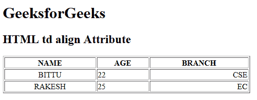

# HTML | td align Attribute

> 原文：[https://www.geeksforgeeks.org/html-td-align-attribute/](https://www.geeksforgeeks.org/html-td-align-attribute/)

The **HTML <td> align attribute** is used to *set the horizontal alignment of text content*. It is not supported by HTML 5.

**Syntax:**

```html
<td align ="left | right | center | justify | char">
```

**Attribute Values:**

*   **left:** It sets the text left-align.
*   **right:** It sets the text right-align.
*   **center:** It sets the text center-align.
*   **justify:** It stretches the text of paragraph to set the width of all lines equal.
*   **char:** It sets the text-align to a specific character.

**Example:**

```html
<!DOCTYPE html>
<html>

<head>
    <title>
      HTML td align Attribute
  </title>
</head>

<body>
    <h1>GeeksforGeeks</h1>

    <h2>HTML td align Attribute</h2>

    <table width="500" border="1">
        <tr>
            <th>NAME</th>
            <th>AGE</th>
            <th>BRANCH</th>
        </tr>

        <tr>
            <td align="center">BITTU</td>
            <td align="left">22</td>
            <td align="right">CSE</td>
        </tr>

        <tr>
            <td align="center">RAKESH</td>
            <td align="left">25</td>
            <td align="right">EC</td>
        </tr>
    </table>
</body>

</html>
```

**Output:**


**Supported Browsers:** The browser supported by **HTML <td> align attribute** are listed below:

*   Google Chrome
*   Internet Explorer
*   Firefox
*   Safari
*   Opera

HTML is the foundation of webpages, is used for webpage development by structuring websites and web apps.You can learn HTML from the ground up by following this [HTML Tutorial](https://www.geeksforgeeks.org/html-tutorials/) and [HTML Examples](https://www.geeksforgeeks.org/html-examples/).