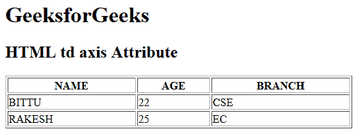

# HTML | td axis Attribute

> 原文：[https://www.geeksforgeeks.org/html-td-axis-attribute/](https://www.geeksforgeeks.org/html-td-axis-attribute/)

The **HTML <td> axis attribute** is used to *categorize the cell content*. It is used for group related information. This attribute does not display visual effect on the web browser but it is used by screen readers. It is not supported by HTML 5.

**Syntax:**

```html
<td axis="category_name">
```

**Attribute Values:**

*   **category_name:** It is used to specify the category name.

**Example:**

```html
<!DOCTYPE html>
<html>

<head>
    <title>
      HTML td axis Attribute
  </title>
</head>

<body>
    <h1>GeeksforGeeks</h1>

    <h2>HTML td axis Attribute</h2>

    <table width="500" border="1">
        <tr>
            <th>NAME</th>
            <th>AGE</th>
            <th>BRANCH</th>
        </tr>

        <tr>
            <td axis="student_info">BITTU</td>
            <td axis="student_info">22</td>
            <td axis="student_info">CSE</td>
        </tr>

        <tr>
            <td axis="student_info">RAKESH</td>
            <td axis="student_info">25</td>
            <td axis="student_info">EC</td>
        </tr>
    </table>
</body>

</html>
```

**Output:**


**Supported Browsers:** The browser supported by **HTML <td> axis attribute** are listed below:

*   Google Chrome
*   Internet Explorer
*   Firefox
*   Safari
*   Opera