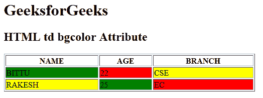

# HTML | td bgcolor Attribute

> 原文：[https://www.geeksforgeeks.org/html-td-bgcolor-attribute/](https://www.geeksforgeeks.org/html-td-bgcolor-attribute/)

The **HTML <td> bgcolor attribute** is used to *specify the background color of a table cell*. It is not supported by HTML 5.

**Syntax:**

```html
<td bgcolor= "color_name | hex_number | rgb_number">
```

**Attribute Values:**

*   **color_name:** It sets the text color by using the color name. For example *“red”*.
*   **hex_number:** It sets the text color by using the color hex code. For example *“#0000ff”*.
*   **rgb_number:** It sets the text color by using the rgb code. For example: *“RGB(0, 153, 0)”*.

**Example:**

```html
<!DOCTYPE html>
<html>

<head>
    <title>HTML bgcolor align Attribute</title>
</head>

<body>
    <h1>GeeksforGeeks</h1>

    <h2>HTML bgcolor align Attribute</h2>

    <table width="500" border="1">
        <tr>
            <th>NAME</th>
            <th>AGE</th>
            <th>BRANCH</th>
        </tr>

        <tr>
            <td bgcolor="green">BITTU</td>
            <td bgcolor="red">22</td>
            <td bgcolor="yellow">CSE</td>
        </tr>

        <tr>
            <td bgcolor="yellow">RAKESH</td>
            <td bgcolor="green">25</td>
            <td bgcolor="red">EC</td>
        </tr>
    </table>
</body>

</html>
```

**Output:**


**Supported Browsers:** The browser supported by **HTML <td> bgcolor attribute** are listed below:

*   Google Chrome
*   Internet Explorer
*   Firefox
*   Safari
*   Opera

HTML is the foundation of webpages, is used for webpage development by structuring websites and web apps.You can learn HTML from the ground up by following this [HTML Tutorial](https://www.geeksforgeeks.org/html-tutorials/) and [HTML Examples](https://www.geeksforgeeks.org/html-examples/).