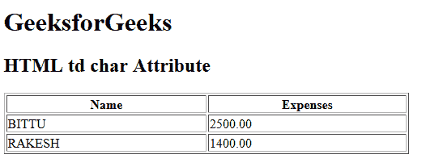

# HTML | td char Attribute

> 原文：[https://www.geeksforgeeks.org/html-td-char-attribute/](https://www.geeksforgeeks.org/html-td-char-attribute/)

The **HTML <td> char Attribute** is used to *specify the alignment to the character of content in a table cell*. This attribute only contains char align attribute. Its default value is a decimal point for page language. It is not supported by HTML 5.

**Syntax:**

```html
<td char="character">
```

**Attribute Values:**

*   **character:** It is used to specify the character to the align the content.

**Example:**

```html
<!DOCTYPE html>
<html>

<head>
    <title>HTML td char Attribute</title>
</head>

<body>
    <h1>GeeksforGeeks</h1>

    <h2>HTML td char Attribute</h2>

    <table width="500" border="1">
        <tr>
            <th>Name</th>
            <th>Expenses</th>
        </tr>

        <tr>
            <td>BITTU</td>
            <td align="char" char=".">
              2500.00
          </td>
        </tr>

        <tr>
            <td>RAKESH</td>
            <td align="char" char=".">
              1400.00
          </td>
        </tr>
    </table>
</body>

</html>
```

**Output:**


**Supported Browsers:** It is not supported by major browsers.