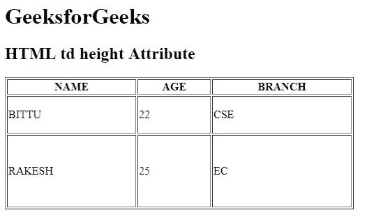

# HTML |身高属性

> 原文:[https://www.geeksforgeeks.org/html-td-height-attribute/](https://www.geeksforgeeks.org/html-td-height-attribute/)

**HTML < td >高度属性**用于*指定表格单元格*的高度。如果未设置< td >高度属性，则根据内容采用默认高度。

**语法:**

```html
<td height="pixels | %">
```

**属性值:**

*   **像素:**以像素为单位设置表格单元格的高度。
*   **%:** 以百分比(%)设置表格单元格的高度。

**注意:**HTML 5 不支持< td >高度属性。
**例:**

## 超文本标记语言

```html
<!DOCTYPE html>
<html>

<head>
    <title>
        HTML td height Attribute
    </title>
</head>

<body>
    <h1>GeeksforGeeks</h1>

    <h2>HTML td height Attribute</h2>

    <table border="1" width="500">
        <tr>
            <th>NAME</th>
            <th>AGE</th>
            <th>BRANCH</th>
        </tr>

        <tr>
            <td height="50">BITTU</td>
            <td height="50">22</td>
            <td height="50">CSE</td>
        </tr>

        <tr>
            <td height="100">RAKESH</td>
            <td height="100">25</td>
            <td height="100">EC</td>
        </tr>
    </table>
</body>

</html>
```

**输出:**



**支持的浏览器:**T2 HTML<TD>高度属性支持的浏览器如下:

*   谷歌 Chrome
*   微软公司出品的 web 浏览器
*   火狐浏览器
*   旅行队
*   歌剧