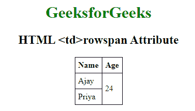

# HTML | td rowspan Attribute

> 原文：[https://www.geeksforgeeks.org/html-td-rowspan-attribute/](https://www.geeksforgeeks.org/html-td-rowspan-attribute/)

The **HTML <td> rowspan Attribute** is used to specify the the number of rows a cell should span. That is if a row spans two rows, it means it will take up the space of two rows in that table. It allows the single table cell to span the height of more than one cell or row. It provides the same functionality as “merge cell” in the spreadsheet program like Excel.

**Syntax:**

```html
<td rowspan="number">
```

**Attribute Values**

*   **number:** It contains the numeric value Which specify the specifies the number of rows that the cell fills. The value must be a integer.

**Example:**

```html
<!DOCTYPE html>
<html>

<head>
    <title>HTML rowspan Attribute</title>
    <style>
        table,
        th,
        td {
            border: 1px solid black;
            border-collapse: collapse;
            padding: 6px;
        }
    </style>
</head>

<body style="text-align:center">

    <h1 style="color: green;">GeeksforGeeks</h1>
    <h2>HTML <td>rowspan Attribute</h2>
    <center>
        <table>
            <tr>
                <th>Name</th>
                <th>Age</th>
            </tr>
            <tr>
                <td>Ajay</td>
                <!-- This cell will take up space on 
                    two rows -->
                <td rowspan="2">24</td>
            </tr>
            <tr>
                <td>Priya</td>
            </tr>
        </table>
    </center>

</body>

</html>
```

**Output:**


**Supported Browsers:** The browsers supported by **HTML td rowspan Attribute** are listed below:

*   Google Chrome
*   Internet Explorer
*   Firefox
*   Apple Safari
*   Opera