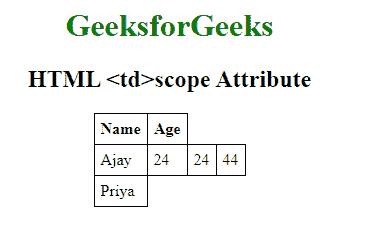

# HTML | td scope Attribute

> 原文：[https://www.geeksforgeeks.org/html-td-scope-attribute/](https://www.geeksforgeeks.org/html-td-scope-attribute/)

The **HTML <td> scope Attribute** is used to *specify the cell is used for header row, column, colgroup or rowgroup*. This attribute does not display any visual effect on the browser but it is used for screen readers.

**Syntax:**

```html
<td scope="col | row | colgroup | rowgroup">
```

**Attribute Values:**

*   **col:** It specifies that the header cell is used for column.
*   **row:** It specifies that the header cell is used for row.
*   **colgroup:** It specifies that the header cell is used for group of column.
*   **rowgroup:** It specifies that the header cell is used for group of row.

**Example:**

```html
<!DOCTYPE html>
<html>

<head>
    <title>HTML scope Attribute</title>
    <style>
        table,
        th,
        td {
            border: 1px solid black;
            border-collapse: collapse;
            padding: 6px;
        }
    </style>
</head>

<body style="text-align:center">

    <h1 style="color: green;">GeeksforGeeks</h1>
    <h2>HTML <td>scope Attribute</h2>
    <center>
        <table>
            <tr>
                <th>Name</th>
                <th>Age</th>
            </tr>
            <tr>
                <td scope="col">Ajay</td>
                <!-- This cell will take up space on 
                    two rows -->
                <td>24</td>
                <td>24</td>
                <td>44</td>
            </tr>
            <tr>
                <td>Priya</td>
            </tr>
        </table>
    </center>

</body>

</html>
```

**Output:**


**Supported Browsers:** The browsers supported by **HTML <td> scope Attribute** are listed below:

*   Google Chrome
*   Internet Explorer
*   Firefox
*   Apple Safari
*   Opera