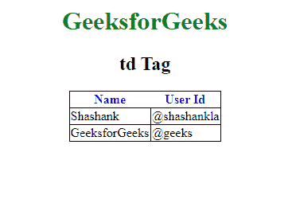

# HTML | td Tag

> 原文：[https://www.geeksforgeeks.org/html-td-tag/](https://www.geeksforgeeks.org/html-td-tag/)

The **<td> tag** is used to define a standard cell in an HTML table.

**Syntax:**

```html
<td>........</td>
```

**Types of cells:**

*   **Header cells**: contains header information(<th>)
*   **Standard cells:** contains data(<td>)

The text in **<th>** elements are bold and centered for heading by default.
The text in **<td>** elements are regular and left-aligned for data by default.

**Attributes:** There are many attributes supported by HTML4.1 but removed from HTML5 are listed below:

*   **abbr:** This attribute is used as abbreviated version of the text content in a header cell.
*   **align:** Set the alignment the text content.
*   **axis:** Categorizes header cells.
*   **bgcolor:** Set the background color of a header cell.
*   **char:** Aligns the content in a header cell to a character.
*   **charoff:** It is used to sets the number of characters that will be aligned from the character specified by the char attribute. The value of these attributes are in numeric form.
*   **colspan:** Number of columns a header cell should span.
*   **headers:** Specifies multiple header cells a cell is related to.
*   **height:** Set the height of a header cell.
*   **nowrap:** It specifies that the content inside a header cell should not wrap.
*   **rowspan:** Set the number of rows a header cell should span.
*   **scope:** It is used to specify the score of header content.
*   **sorted:** It is used to sort the direction of a column.
*   **valign:** It is used to set the vertical alignment of text content.
*   **width:** It is used to set the width of a header cell

**Example:**

```html
<!DOCTYPE html> 
<html> 
    <head> 
        <title>td tag</title> 
        <style> 
            body { 
                text-align:center; 
            } 
            h1 { 
                color:green; 
            } 
            th { 
                color:blue; 
            } 
            table, tbody, td { 
                border: 1px solid black; 
                border-collapse: collapse; 
            } 
        </style> 
    </head> 
    <body> 
        <center> 
        <h1>GeeksforGeeks</h1> 
        <h2>td Tag</h2> 
        <table> 
            <thead> 
                <tr> 
                    <th>Name</th> 
                    <th>User Id</th> 
                </tr> 
            </thead> 
            <tbody> 
                <tr> 
                    <td>Shashank</td> 
                    <td>@shashankla</td> 
                </tr> 
                    <tr> 
                    <td>GeeksforGeeks</td> 
                    <td>@geeks</td> 
                </tr> 
            </tbody> 
        </table> 
        </center> 
    </body> 
</html>                                     
```

**Output:**


**Supported Browsers:** The browser supported by **td tag** are listed below

*   Google Chrome
*   Edge
*   Firefox
*   Safari
*   Opera