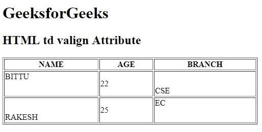

# HTML | td valign Attribute

> 原文：[https://www.geeksforgeeks.org/html-td-valign-attribute/](https://www.geeksforgeeks.org/html-td-valign-attribute/)

The **HTML <td> valign Attribute** is used to *specify the vertical alignment of text content in a cell*.

**Syntax:**

```html
<td valign="top | middle | bottom | baseline">
```

**Attribute Value:**

*   **top:** It sets the content to top-align.
*   **middle:** It sets the content to middle-align.
*   **bottom:** It sets the content to bottom-align.
*   **baseline:** It sets the content to baseline. The baseline is the line where most of the characters sit.

**Note:** The <td> valign Attribute is not supported by HTML 5.

**Example:**

```html
<!DOCTYPE html>
<html>

<head>
    <title>
        HTML td valign Attribute
    </title>
</head>

<body>
    <h1>GeeksforGeeks</h1>

    <h2>HTML td valign Attribute</h2>

    <table border="1" width="500">
        <tr>
            <th>NAME</th>
            <th>AGE</th>
            <th>BRANCH</th>
        </tr>

        <tr style="height:50px;">
            <td valign="top">BITTU</td>
            <td valign="center">22</td>
            <td valign="bottom">CSE</td>
        </tr>

        <tr style="height:50px;">
            <td valign="bottom">RAKESH</td>
            <td valign="center">25</td>
            <td valign="top">EC</td>
        </tr>
    </table>
</body>

</html>
```

**Output:**


**Supported Browsers:** The browser supported by **HTML <td> valign Attribute** are listed below:

*   Google Chrome
*   Internet Explorer
*   Firefox
*   Safari
*   Opera

HTML is the foundation of webpages, is used for webpage development by structuring websites and web apps.You can learn HTML from the ground up by following this [HTML Tutorial](https://www.geeksforgeeks.org/html-tutorials/) and [HTML Examples](https://www.geeksforgeeks.org/html-examples/).