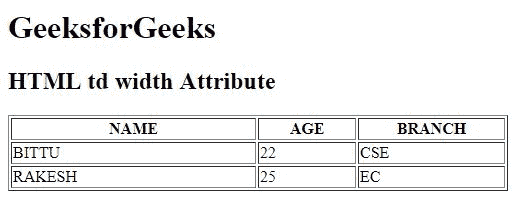

# HTML | td width Attribute

> 原文：[https://www.geeksforgeeks.org/html-td-width-attribute/](https://www.geeksforgeeks.org/html-td-width-attribute/)

The **HTML <td> width Attribute** is used to *specify the width of a table cell*. If width attribute is not set then it takes default width according to content.

**Syntax:**

```html
<td width="pixels | %">
```

**Attribute Values:**

*   **pixels:** It sets the width of table in terms of pixels.
*   **%:** It sets the width of table in terms of percentage (%).

**Note:** The <td> width Attribute is not supported by HTML 5.

**Example:**

```html
<!DOCTYPE html>
<html>

<head>
    <title>
        HTML td width Attribute
    </title>
</head>

<body>
    <h1>GeeksforGeeks</h1>

    <h2>HTML td width Attribute</h2>

    <table border="1" 
           width="500">
        <tr>
            <th>NAME</th>
            <th>AGE</th>
            <th>BRANCH</th>
        </tr>

        <tr>
            <td width="50%">BITTU</td>
            <td width="20%">22</td>
            <td width="30%">CSE</td>
        </tr>

        <tr>
            <td>RAKESH</td>
            <td>25</td>
            <td>EC</td>
        </tr>
    </table>
</body>

</html>
```

**Output:**


**Supported Browsers:** The browser supported by **HTML <td> width Attribute** are listed below:

*   Google Chrome
*   Internet Explorer
*   Firefox
*   Safari
*   Opera

HTML is the foundation of webpages, is used for webpage development by structuring websites and web apps.You can learn HTML from the ground up by following this [HTML Tutorial](https://www.geeksforgeeks.org/html-tutorials/) and [HTML Examples](https://www.geeksforgeeks.org/html-examples/).