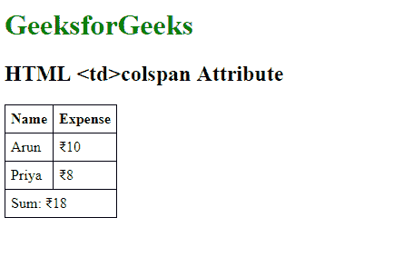

# HTML | tdcolspan Attribute

> 原文：[https://www.geeksforgeeks.org/html-tdcolspan-attribute/](https://www.geeksforgeeks.org/html-tdcolspan-attribute/)

The **HTML <td> colspan Attribute** is used to specify *the number of columns a table should span*.

**Syntax:**

```html
<td colspan="number"> 
```

**Attribute Values:** It contains the numeric value which specifies the number of columns a cell should span.

**Example:** This Example illustrates the use of colspan attribute in Tabledata Element.

```html
<!DOCTYPE html>
<html>

<head>
    <title>
      HTML <td>colspan Attribute
  </title>
    <style>
        table,
        th,
        td {
            border: 1px solid black;
            border-collapse: collapse;
            padding: 6px;
        }
    </style>
</head>

<body>
    <h1 style="color: green;">
      GeeksforGeeks
  </h1>
    <h2>
      HTML <td>colspan
      Attribute
  </h2>
    <table>
        <tr>
            <th>Name</th>
            <th>Expense</th>
        </tr>
        <tr>
            <td>Arun</td>
            <td>₹10</td>
        </tr>
        <tr>
            <td>Priya</td>
            <td>₹8</td>
        </tr>

        <!-- The last row -->
        <tr>
            <!-- This td will span 
                two columns, that is 
                a single column will 
                take up the space of 2 -->
            <td colspan="2">
              Sum: ₹18
          </td>
        </tr>
    </table>
</body>

</html>
```

**Output:**


**Supported Browsers:** The browser supported by **HTML <td>colspan Attribute** are listed below:

*   Google Chrome
*   Internet Explorer
*   Firefox
*   Opera
*   Safari