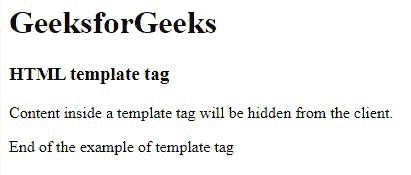
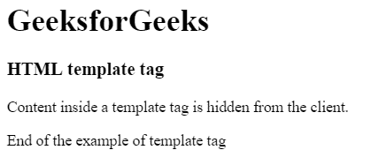
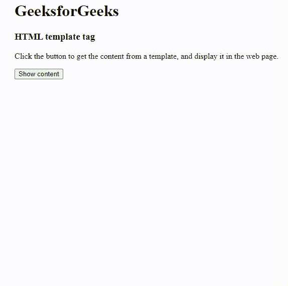

# HTML 模板标签

> 原文:[https://www.geeksforgeeks.org/html-template-tag/](https://www.geeksforgeeks.org/html-template-tag/)

**示例:**在本例中，我们有一个无序的课程列表，我们使用 HTML 中的<模板>标签隐藏了这些课程以进行显示。

## 超文本标记语言

```html
<!DOCTYPE html>
<html>
<body>
    <h1>GeeksforGeeks</h1>
    <h3>HTML template tag</h3>
    <p>
      Content inside a template tag will 
      be hidden from the client.
    </p>

    <!-- Html script tag starts here -->
    <template>
        <h2>GeeksforGeeks: A computer science portal</h2>
        <h4>GeeksforGeeks Offline Courses</h4>
        <ul>
            <li>DSA</li>
            <li>Placement & Interview Preparation</li>
            <li>Web Development</li>
            <li>Algorithms & basic programming</li>
        </ul>
    </template>
    <!-- Html template tag ends here -->

<p>End of the example of template tag</p>

</body>
</html>
```

**输出:**



HTML 中的<template></template>

**语法:**

```html
<template> Contents... </template>
```

**注意:**<模板>标签在 HTML 5 中是新的。

**支持的属性:**这个标签支持 HTML 中的[全局属性](https://www.geeksforgeeks.org/html-global-attributes/)。

**示例 1:** 这个示例使用了一个模板标签，它隐藏了模板标签内的内容。

## 超文本标记语言

```html
<!DOCTYPE html>
<html>
<body>
    <h1>GeeksforGeeks</h1>
    <h3>HTML template tag</h3>
    <p>
      Content inside a template tag
      is hidden from the client.
    </p>

    <!-- html script tag starts here -->
    <template>
        <h2>GeeksforGeeks: A computer science portal</h2> 
        
            Content Writer:
        <input type="text" 
               placeholder="author name"> 
    </template>
    <!-- html template tag ends here -->

    <p>End of the example of template tag</p>

</body>
</html>
```

**输出:**



**示例 2:** 这个示例说明了使用 JavaScript 来显示模板标签内容。

## 超文本标记语言

```html
<!DOCTYPE html>
<html>
<body>
    <h1>GeeksforGeeks</h1>
    <h3>HTML template tag</h3>
    <p> 
      Click the button to get the content from a template, 
      and display it in the web page. 
    </p>

    <button onclick="myGeeks()"> Show content </button>

    <!-- Html template tag starts here -->
    <template>
        <h2>GeeksforGeeks: A computer science portal</h2> 
        
        <br> 
        Content Writer:
        <input type="text" 
               placeholder="author name"> 
    </template>
    <!-- Html template tag ends here -->

    <!-- Script to display the content of template tag -->
    <script>
    function myGeeks() {
        var t = document.getElementsByTagName("template")[0];
        var clone = t.content.cloneNode(true);
        document.body.appendChild(clone);
    }
    </script>
</body>
</html>
```

**输出:**



**支持的浏览器:**

*   谷歌 Chrome 93.0 及以上
*   微软边缘 93.0
*   火狐 92.0 及以上版本
*   Safari 14.1
*   Opera 79.0