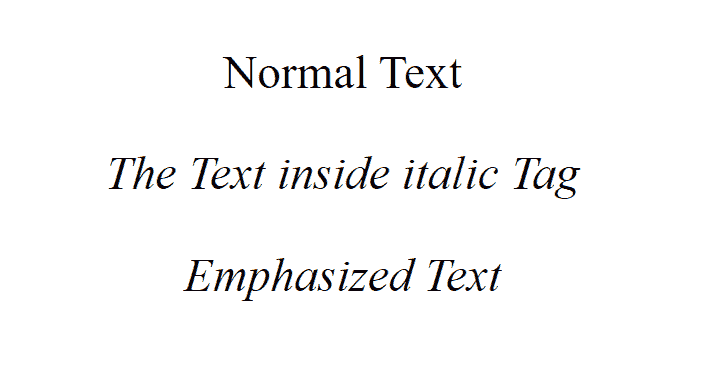

# HTML 文本格式元素

> 原文:[https://www . geesforgeks . org/html-text-formating-elements/](https://www.geeksforgeeks.org/html-text-formatting-elements/)

正如我们所知，HTML 提供了许多预定义的元素，用于更改文本的格式。格式可用于设置文本样式(如粗体、斜体或强调等)。)，突出文字，使文字上标和下标等。

**文本格式元素:**

**[**< b >**](https://www.geeksforgeeks.org/html-b-tag/) 和 [**<强>**](https://www.geeksforgeeks.org/html-strong-tag/) 标签:**这两个标签都用于使文本加粗。标签的文本内容在网页中显示为重要信息。

**示例:**

## 超文本标记语言

```html
<!DOCTYPE html>
<html>

<head>
    <title>Bold and strong</title>
</head>

<body>
    <!--Normal text-->
    <p>Normal Text</p>

    <!--Text in Bold-->
    <p><b>Bold Text</b></p>

    <!--Text in Strong-->
    <p><strong> Strong Text</strong></p>
</body>

</html>
```

**输出:**


**HTML[**<I>**](https://www.geeksforgeeks.org/html-i-tag/)和[**<em>**](https://www.geeksforgeeks.org/html-em-tag/)Tags:**这两个 Tags 都是用来使文字倾斜和强调的。这两个元素都有一个开始和结束标记。

**示例:**

## 超文本标记语言

```html
<!DOCTYPE html>
<html>

<head>
    <title>Italic and emphasized</title>
</head>

<body>
    <!--Normal text-->
    <p>Normal Text</p>

    <!--Text in Italics-->
    <p><i>The Text inside italic Tag</i></p>

    <!--Text in Emphasize-->
    <p><em>Emphasized Text</em></p>
</body>

</html>
```

**输出:**



**HTML [**<小>**](https://www.geeksforgeeks.org/html-small-tag/) 和 [**<大>** 标签:](https://www.geeksforgeeks.org/html-big-tag/)**小<标签用于设置小字号，大<标签用于设置大字号。

**示例:**

## 超文本标记语言

```html
<!DOCTYPE html>
<html>

<head>
    <title>Small and Big</title>
</head>

<body>
    <!--Text in Normal-->
    <p>Normal text</p>

    <small>The text inside small Tag</small>

    <p>
        <big>The text inside big Tag</big>
    </p>
</body>

</html>
```

**输出:**


**HTML[**<sup>**](https://www.geeksforgeeks.org/html-sup-tag/)和 [**< sub >**](https://www.geeksforgeeks.org/html-sub-tag/) 标签:**<sup>标签用于上标文本，而< sub >标签用于下标文本。

**示例:**

## 超文本标记语言

```html
<!DOCTYPE html>
<html>

<head>
    <title>Superscript and Subscript</title>
</head>

<body>

    <!--Text in Normal-->
    <p>Normal Text

    <!--Text in Superscript-->
    <p>
        <sup>superscript </sup> Text
    </p>

    <!--Text in Subscript-->
    <p>
        <sub>subscript</sub>Text
    </p>
</body>

</html>
```

**输出:**


**HTML[**<ins>**](https://www.geeksforgeeks.org/html-ins-tag/)和 [**< del >**](https://www.geeksforgeeks.org/html-del-tag/) 标记:**<ins>标记用于在文本上加下划线，标记插入或添加的部分。它还有一个开始标签和一个结束标签。该标签主要用于文本中代替删除的文本，而 **< del >** 标签用于删除文本，它在文本上增加了一条删除线。

**示例:**

## 超文本标记语言

```html
<!DOCTYPE html>
<html>

<head>
    <title>Inserting and deleting</title>
</head>

<body>
    <!--Deleting andText in Insert-->
    <b>
        <p>The TajMahal is located in 
            <del>Bombay</del>
            <ins>Agra</ins>
        </p>
    </b>
</body>

</html>
```

**输出:**


**HTML [**<标记>**](https://www.geeksforgeeks.org/html-mark-tag/) 标签:**<标记>标签用于突出显示文本。它有一个开始和结束标签。

**示例:**

## 超文本标记语言

```html
<!DOCTYPE html>
<html>

<head>
    <title>Highlight</title>
</head>

<body>

    <!--Text in Normal-->
    <p>Normal Text</p>

    <!--Text in Highlight-->
    <p>
        <mark>Highlighted Text</mark>
    </p>
</body>

</html>
```

**输出:**

