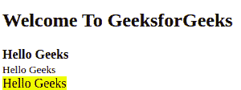
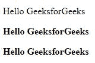
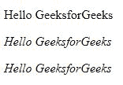
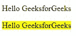
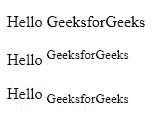
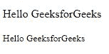
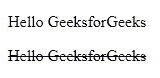
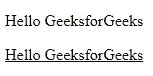

# HTML |文本格式

> 原文:[https://www.geeksforgeeks.org/html-text-formatting/](https://www.geeksforgeeks.org/html-text-formatting/)

**示例:**在本例中，我们简单地分别以 HTML 强、小和高亮格式显示文本。

## 超文本标记语言

```html
<!DOCTYPE html>
<html>

<body>
  <h2>Welcome To GeeksforGeeks</h2>

  <!--Text in Strong-->
  <strong>Hello Geeks</strong>
  <br>
  <!--Text in small-->
  <small>Hello Geeks</small>
  <br>
  <!--Text in Highlight-->
  <mark>Hello Geeks</mark>
</body>

</html>
```

**输出:**



HTML 为我们提供了格式化文本的能力，就像我们在微软 Word 或任何文本编辑软件中所做的那样。在本文中，我们将讨论几个这样的选项。

*   **使文本加粗或变强**:我们可以使用 **< b >** 标签使文本**加粗**。标签同时使用开始和结束标签。需要加粗的文字必须在 **< b >** 和 **< /b >** 标签内。
    我们还可以使用 **< strong >** 标签来使文本变强，增加了语义的重要性。也以< strong >开头，以< /strong >标签结尾。
    **例**:

## 超文本标记语言

```html
<!DOCTYPE html>
<html>
<head>
    <title>Bold</title>
</head>
<body>
    <!--Normal text-->

<p>Hello GeeksforGeeks</p>

    <!--Text in Bold-->

<p><b>Hello GeeksforGeeks</b></p>

    <!--Text in Strong-->   

<p><strong>Hello GeeksforGeeks</strong></p>

</body>
</html>
```

**输出**:



*   **制作文字** ***斜体*** 或 ***强调*****:****<I>**标记用于*斜体*文字。以< i >开始，以< /i >标记结束。
    **<em>**标记用于*强调*文本，增加了语义的重要性。它以< em >开始，以< /em >标记结束。
    **例**:

## 超文本标记语言

```html
<!DOCTYPE html>
<html>
<head>
    <title>Italic</title>
</head>
<body>
    <!--Normal text-->

<p>Hello GeeksforGeeks</p>

    <!--Text in Italics-->

<p><i>Hello GeeksforGeeks</i></p>

    <!--Text in Emphasize-->   

<p><em>Hello GeeksforGeeks</em></p>

</body>
</html>
```

**输出**:



*   **突出显示文本:**也可以使用 **<标记>** 来突出显示 HTML 中的文本。它有一个开始标签<标记>和一个结束标签</标记>。
    **例**:

## 超文本标记语言

```html
<!DOCTYPE html>
<html>
<head>
    <title>Highlight</title>
</head>
<body>
    <!--Text in Normal-->

<p>Hello GeeksforGeeks</p>

    <!--Text in Highlight-->   

<p><mark>Hello GeeksforGeeks</mark></p>

</body>
</html>
```

**输出**:



*   **使文本下标或上标:****<sup>**元素用于给文本标上标，而< sub >元素用于给文本标下标。它们都有开始和结束标签。
    **例**:

## 超文本标记语言

```html
<!DOCTYPE html>
<html>
<head>
    <title>Superscript and Subscript</title>
</head>
<body>
    <!--Text in Normal-->

<p>Hello GeeksforGeeks</p>

    <!--Text in Superscript-->   

<p>Hello <sup>GeeksforGeeks</sup></p>

    <!--Text in Subscript-->   

<p>Hello <sub>GeeksforGeeks</sub></p>

</body>
</html>
```

**输出**:



*   **使文本变小:****<小>** 元素用于使文本变小。需要小一点显示的文字要写在<小>、</小>标签里面。
    **例**:

## 超文本标记语言

```html
<!DOCTYPE html>
<html>
<head>
    <title>Small</title>
</head>
<body>
    <!--Text in Normal-->

<p>Hello GeeksforGeeks</p>

    <!--Text in small-->   

<p><small>Hello GeeksforGeeks</small></p>

</body>
</html>
```

**输出**:



*   **穿透文本:****<del>**元素用于穿透文本，将该部分标记为已删除。它还有一个开始标签和一个结束标签。
    **例**:

## 超文本标记语言

```html
<!DOCTYPE html>
<html>
<head>
    <title>Delete</title>
</head>
<body>
    <!--Text in Normal-->

<p>Hello GeeksforGeeks</p>

    <!--Text in Delete-->   

<p><del>Hello GeeksforGeeks</del></p>

</body>
</html>
```

**输出**:



*   **添加文本:****<ins>**元素用于给标记为插入或添加的部分的文本加下划线。它还有一个开始标签和一个结束标签。
    **例**:

## 超文本标记语言

```html
<!DOCTYPE html>
<html>
<head>
    <title>Inserting</title>
</head>
<body>
    <!--Text in Normal-->

<p>Hello GeeksforGeeks</p>

    <!--Text in Insert-->   

<p><ins>Hello GeeksforGeeks</ins></p>

</body>
</html>
```

**输出**:



**支持的浏览器:**

*   谷歌 Chrome
*   微软边缘
*   火狐浏览器
*   歌剧
*   旅行队