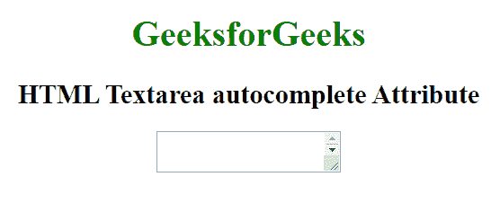

# HTML | textarea autocomplete Attribute

> 原文：[https://www.geeksforgeeks.org/html-textarea-autocomplete-attribute/](https://www.geeksforgeeks.org/html-textarea-autocomplete-attribute/)

The **HTML <textarea> autocomplete Attribute** is used to specify whether the Textarea field has autocomplete on or off. When the autocomplete attribute is set to on, the browser will automatically complete the values based on which the user entered before. It works with many input fields such as text, search, URL, email, password, date pickers, range, and color.

**Syntax:**

```html
<Textarea autocomplete="on | off">
```

**Attribute Values:**

*   **on:** It specifies that autocomplete is enabled.
*   **off:** It specifies that the autocomplete is disabled.

**Example:** This example illustrates the use of autocomplete attribute in textarea element

```html
<!DOCTYPE html>
<html>

<head>
    <title>
        HTML textarea autocomplete Attribute
    </title>
</head>

<body style="text-align:center">
    <h1 style="color: green;">
        GeeksforGeeks
    </h1>
    <h2>
        HTML Textarea
        autocomplete Attribute
    </h2>

    <textarea id="geeks" autocomplete="on"
         autofocus>
        write something here---- 
    </textarea>
</body>

</html> 
```

**Output:**


**Supported Browsers:** The browsers supported by **HTML | <textarea> autcomplete attribute** are listed below:

*   Google Chrome
*   Internet Explorer
*   Firefox
*   Opera
*   Safari