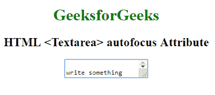

# HTML | textarea autofocus Attribute

> 原文：[https://www.geeksforgeeks.org/html-textarea-autofocus-attribute/](https://www.geeksforgeeks.org/html-textarea-autofocus-attribute/)

The **HTML <textarea> autofocus Attribute** is used to specify that *the textarea field should get automatically focus when the page loads*. It is a Boolean Attribute.

**Syntax:**

```html
<textarea autofocus>
```

**Example:** This Example illustrates the use of autofocus attribute in Textarea Element.

```html
<!DOCTYPE html>
<html>

<head>
    <title>
      HTML textarea autofocus Attribute
  </title>
</head>

<body style="text-align:center">
    <h1 style="color: green;">
      GeeksforGeeks
  </h1>
    <h2>
      HTML <Textarea> 
      autofocus Attribute
  </h2>
        <textarea id="geeks"
                  autofocus>
          write something here----
  </textarea>
</body>

</html>
```

**Output:**


**Supported Browsers:** The browser supported by **HTML | <Textarea>autofocus Attribute** are listed below:

*   Google Chrome
*   Internet Explorer
*   Firefox
*   Opera
*   Safari