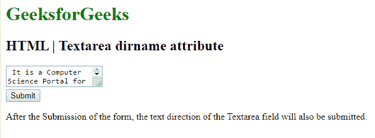

# HTML | textarea dirname Attribute

> 原文：[https://www.geeksforgeeks.org/html-textarea-dirname-attribute-2/](https://www.geeksforgeeks.org/html-textarea-dirname-attribute-2/)

The **HTML <textarea> dirname attribute** is used to enable the text direction of the input and the Textarea Field after submitting the form. The value of the dirname attribute must be the name of the input field and textarea, followed by “.dir”.

**Syntax:**

```html
<textarea name="myname" dirname="myname.dir">
```

**Attribute Values:**
**name.dir:** It specifies the text direction of the textarea that are submitted.

**Example:**

```html
<!DOCTYPE html>
<html>

<head>
    <style>
        h1 {
            color: green;
        }
    </style>
</head>

<body>

    <form action="#">
        <h1> 
            GeeksforGeeks 
        </h1>
        <h2> 
            HTML Textarea dirname attribute 
        </h2>

        <textarea name="fname"
            dirname="fname.dir">
            It is a Computer Science
            Portal for Geeks.
        </textarea>

        <input type="submit"
            value="Submit">
    </form>

    <p>
        After the Submission of the
        form, the text direction of
        the Textarea field will 
        also be submitted.
    </p>
</body>

</html>
```

**Output:**


**Supported Browsers:** The browsers supported by **HTML <textarea> dirname attribute** are listed below:

*   Google Chrome
*   Internet Explorer
*   Firefox
*   Apple Safari
*   Opera