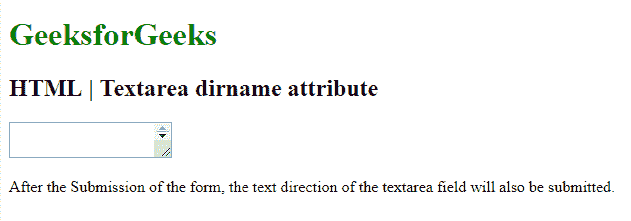

# HTML | textarea dirname Attribute

> 原文：[https://www.geeksforgeeks.org/html-textarea-dirname-attribute/](https://www.geeksforgeeks.org/html-textarea-dirname-attribute/)

The **HTML <textarea> dirname Attribute** is used to enable the text direction of the Textarea Field after submitting the form. The value of the dirname attribute must be the name of the input field and textarea, followed by **“.dir”**.

**Syntax:**

```html
<textarea name="myname" dirname="myname.dir"></textarea>
```

**Attribute Values:**

*   **dir.name**It specify that the text direction of the Textarea will be submitted.

Below Example illustrates the use of dirname attribute in Textarea Element.
**Example:**

```html
<!DOCTYPE html>
<html>

<head>
    <title>
        HTML <textarea> dirname Attribute
    </title>
    <style>
        h1 {
            color: green;
        }
    </style>
</head>

<body>

    <form>
        <h1> 
        GeeksforGeeks 
    </h1>
        <h2> 
        HTML | Textarea dirname attribute 
    </h2>
        <Textarea name="fname"
                  dirname="fname.dir"
                  width="190px">

        </Textarea>

        <p>
            After the Submission of the form,
          the text direction of the textarea field
          will also be submitted.
        </p>
    </form>

</body>

</html>
```

**Output:**


**Supported Browsers:** The browsers supported by **HTML <textarea> dirname Attribute** are listed below:

*   Google Chrome
*   Internet Explorer
*   Firefox
*   Apple Safari
*   Opera