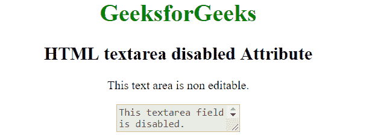

# HTML textarea disabled Attribute

> 原文：[https://www.geeksforgeeks.org/html-textarea-disabled-attribute/](https://www.geeksforgeeks.org/html-textarea-disabled-attribute/)

The **disabled** attribute for <textarea> element in HTML is used to specify that the text area element is disabled. A disabled text area is un-clickable and unusable. It is a boolean attribute.

**Syntax:**

```html
<textarea disabled>text content...</textarea>

```

**Example:**

```html
<!DOCTYPE html> 
<html> 
    <head> 
        <title>HTML textarea disabled Attribute</title> 
    </head> 
    <body style = "text-align:center">    
        <h1 style = "color: green;">GeeksforGeeks</h1>
        <h2>HTML textarea disabled Attribute</h2>

        <p>This text area is non editable.</p>

        <!--A disabled textarea-->
        <textarea disabled>
            This textarea field is disabled.
        </textarea>
    </body> 
</html>    
```

**Output:**


**Supported Browsers:** The browser supported by <textarea> disabled attribute are listed below:

*   Apple Safari
*   Google Chrome
*   Firefox
*   Opera
*   Internet Explorer