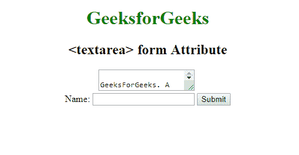

# HTML | textarea form Attribute

> 原文：[https://www.geeksforgeeks.org/html-textarea-form-attribute/](https://www.geeksforgeeks.org/html-textarea-form-attribute/)

The **HTML <textarea> form Attribute** is used to *specify the one or more forms that the <Textarea> element belongs to*.
**Syntax: **

```html
<Textarea form="form_id"> 
```

**Attribute Values: **

*   **form_id:** It Contains the value i.e *form_id* which specify the one or more  form that the Textarea element belongs to. The value of this attribute should be id of the <form> element.

**Example: **

## html

```html
<!DOCTYPE html>
<html>

<head>
    <title>Textarea Form Attribute</title>
    <style>
    }
    fieldset {
        width: 50%;
        margin-left: 22%;
    }
    h1 {
        color: green;
    }
    </style>
</head>

<body>
    <center>
        <h1>GeeksforGeeks</h1>
        <h2><textarea> form Attribute</h2>
        <textarea form="mygeeks" cols="20" ;>
            GeeksForGeeks. A computer science portal for Geeks
        </textarea>
        <br>
        <form id="mygeeks">
            Name:
            <input type="text" name="usrname">
            <input type="submit">
        </form>
    </center>
</body>

</html>
```

**Output:** 



**Supported Browsers:** The browser supported by **HTML <Textarea>form Attribute** are listed below: 

*   Google Chrome
*   Internet Explorer 10.0 +
*   Firefox
*   Opera
*   Safari