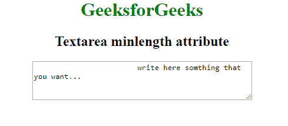

# HTML | Textarea minlength Attribute

> 原文：[https://www.geeksforgeeks.org/html-textarea-minlength-attribute/](https://www.geeksforgeeks.org/html-textarea-minlength-attribute/)

The **HTML <Textarea> minlength Attribute** is used to define the minimum number of characters (as UTF-16 code units) of a Textarea Element. The Integer value must start with 0 or higher. 
**Syntax: **

```html
<Textarea minlength="numeric"> 
```

**Attribute Value:** 

*   **number:** It contains the numeric value i.e 0 or higher.

**Example: **

## html

```html
<!DOCTYPE html>
<html>

<body>
    <center>
        <h1 style="color:green;">
        GeeksforGeeks
        </h1>
        <h2>
       Textarea minlength attribute
        </h2>
        <textarea rows="4"
                  cols="50"
                  minlength="6">
            write here something that you want...
        </textarea>
    </center>
</body>

</html>
```

**Output:** 



**Supported Browsers:** The browsers supported by **<Textarea> minlength Attribute** are listed below: 

*   Google Chrome
*   Internet Explorer
*   Firefox
*   Apple Safari
*   Opera