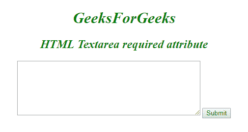

# HTML | textarea name Attribute

> 原文：[https://www.geeksforgeeks.org/html-textarea-name-attribute/](https://www.geeksforgeeks.org/html-textarea-name-attribute/)

The **HTML <textarea> name** Attribute is used to *specify a name of the <Textarea> Element*. It is used to reference the form-data after submitting the form or to reference the element in a JavaScript.

Syntax:

```html
<Textarea name="text"> 
```

**Attribute Values:** It contains the value i.e name which specify the name for the <Textarea> element.

**Example:**

```html
<!DOCTYPE html>
<html>

<head>
    <title>
        HTML Textarea name Attribute
    </title>
</head>

<body>
  <center>
    <h1 style="color: green;"> 
            GeeksforGeeks 
        </h1>

    <h2> 
            HTML Textarea name Attribute 
        </h2>

    <textarea id="GFG" name="GFG_text">
        A computer science portal for geeks.
    </textarea>

    <br>
  </center>
</body>

</html>
```

**Output:**


**Supported Browsers:**

*   Google Chrome
*   Firefox
*   Edge
*   Opera
*   Apple Safari