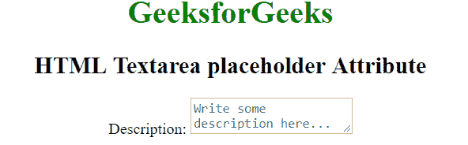
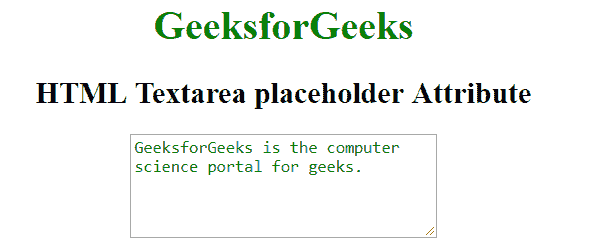

# HTML | textarea placeholder Attribute

> 原文：[https://www.geeksforgeeks.org/html-textarea-placeholder-attribute/](https://www.geeksforgeeks.org/html-textarea-placeholder-attribute/)

The **<textarea> placeholder attribute** in HTML is used to specify the expected value to be displayed before user input in textarea element.

**Syntax:**

```html
<textarea placeholder="text">
```

**Attribute Value:** This attribute contains single value **text** which is the initial string to be displayed before user input.

**Example 1:** This example uses <textarea> placeholder attribute to display the textarea placeholder description.

```html
<!DOCTYPE html> 
<html> 

<head> 
    <title>
        HTML Textarea placeholder Attribute
    </title> 
</head> 

<body style = "text-align:center">     

    <h1 style = "color: green;">
        GeeksforGeeks
    </h1> 

    <h2>
        HTML Textarea placeholder Attribute
    </h2> 

    Description: <textarea placeholder
        ="Write some description here..."></textarea> 
</body> 

</html>                    
```

**Output:**


**Example 2:** This example uses <textarea> placeholder attribute to display the textarea placeholder description.

```html
<!DOCTYPE html> 
<html> 

<head> 
    <title>HTML Textarea placeholder Attribute</title> 

    <style>
        textarea::-webkit-input-placeholder {
            color: #0bf;
        }

        /* Firefox 18- */
        textarea:-moz-placeholder {
            color: #0bf; 
        }

        /* Firefox 19+ */
        textarea::-moz-placeholder {
            color: #0bf; 
        }

        textarea:-ms-input-placeholder {
            color: #0bf; 
        }

        textarea::placeholder {
            color: green; 
        }
    </style>
</head>

<body style = "text-align:center">     
    <h1 style = "color: green;">
        GeeksforGeeks
    </h1> 

    <h2>
        HTML Textarea placeholder Attribute
    </h2> 

    <textarea placeholder="GeeksforGeeks is the computer"
        + " science portal for geeks."></textarea>

</body> 

</html>                    
```

**Output:**


**Supported Browsers:** The browser supported by <textarea> placeholder attribute are listed below:

*   Apple Safari 5.0
*   Google Chrome
*   Firefox 4.0
*   Opera 11.5
*   Internet Explorer 10.0