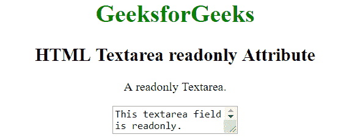
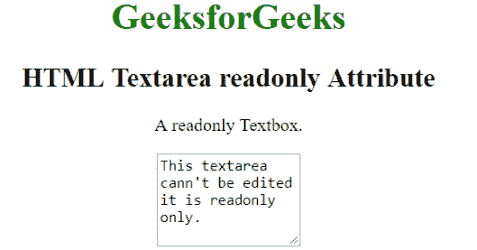

# HTML | textarea readonly Attribute

> 原文：[https://www.geeksforgeeks.org/html-textarea-readonly-attribute/](https://www.geeksforgeeks.org/html-textarea-readonly-attribute/)

The **<textarea> readonly attribute** in HTML is used to specify that the textarea element is read-only. If the textarea is readonly, then it’s content cannot be changed but can be copied and highlighted. It is a boolean attribute.
**Syntax:** 

```html
<textarea readonly> Contents... </textarea>
```

**Example 1:** This example uses <textarea> readonly attribute to write content on input textarea which is readable only. 

## html

```html
<!DOCTYPE html>
<html>
    <head>
        <title>
            HTML Textarea readonly Attribute
        </title>
    </head>

    <body style = "text-align:center">    

        <h1 style = "color: green;">
            GeeksforGeeks
        </h1>

        <h2>
            HTML Textarea readonly Attribute
        </h2>

<p>A readonly Textarea.</p>

        <!--A readonly Textarea-->
        <textarea readonly>This textarea field is readonly.
        </textarea>
    </body>
</html>                   
```

**Output:** 



**Example 2:** This example uses <textarea> readonly attribute to write content on input textarea which is readable only. 

## html

```html
<!DOCTYPE html>
<html>
    <head>
        <title>
            HTML Textarea readonly Attribute
        </title>
    </head>

    <body style = "text-align:center">    

        <h1 style = "color: green;">
            GeeksforGeeks
        </h1>

        <h2>
            HTML Textarea readonly Attribute
        </h2>

<p>A readonly Textbox.</p>

        <textarea readonly="readonly" cols="15" rows="5">
            This textarea can't be edited it is readonly only.
        </textarea>
    </body>
</html>                   
```

**Output:** 



**Supported Browsers:** The browser supported by <textarea> readonly attribute are listed below: 

*   Apple Safari
*   Google Chrome
*   Firefox
*   Opera
*   Internet Explorer