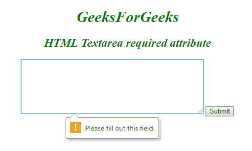

# HTML | textarea required Attribute

> 原文：[https://www.geeksforgeeks.org/html-textarea-required-attribute/](https://www.geeksforgeeks.org/html-textarea-required-attribute/)

The **HTML <textarea> required Attribute** is a Boolean attribute which is used to specify that *the <textarea> element must be filled out before submitting the Form*.

**Syntax:**

```html
<textarea required> 
```

**Example:** This Example illustrates the use of required attribute in Textarea Element.

```html
<!DOCTYPE html>
<html>

<head>
    <title>required Attribute</title>
    <style>
        h1,
        h2 {
            color: green;
            font-style: italic;
        }

        body {
            text-align: center;
        }
    </style>
</head>

<body>
    <h1>GeeksForGeeks</h1>
    <h2>HTML Textarea required attribute </h2>
    <form action="#">
        <textarea rows="7"
                  cols="50" 
                  name="comment" 
                  required></textarea>
        <input type="submit">
    </form>
</body>

</html>
```

**output:**


**Supported Browsers:** The browser supported by **HTML Textarea required Attribute** are listed below:

*   Google Chrome
*   Internet Explorer
*   Firefox
*   Opera