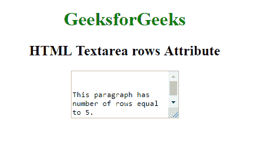

# HTML | textarea rows Attribute

> 原文：[https://www.geeksforgeeks.org/html-textarea-rows-attribute/](https://www.geeksforgeeks.org/html-textarea-rows-attribute/)

The **HTML textarea rows Attribute** is used to specify the number of visible text lines for the control i.e the number of rows to display. It also specifies the visible height of the Textarea.

**Syntax:**

```html
<textarea rows = "value">
```

**Attribute Values:**

*   **number:** It specify the height of the Textarea. Its Default value is 2.

**Example:**

```html
<!DOCTYPE html>
<html>

<head>
    <title>
        HTML Textarea rows Attribute
    </title>
</head>

<body>
    <center>
        <h1 style="color: green;"> 
            GeeksforGeeks 
        </h1>

        <h2> 
            HTML Textarea rows Attribute 
        </h2>

        <!-- Below textarea element has rows 
            attribute assigned to 5 -->
        <textarea rows="5" cols="23">
            This paragraph has number 
          of rows equal to 5.
        </textarea>
    </center>
</body>

</html>
```

**Output:**


**Supported Browsers:** The browsers supported by **HTML textarea rows Attribute** are listed below:

*   Google Chrome
*   Internet Explorer
*   Firefox
*   Apple Safari
*   Opera