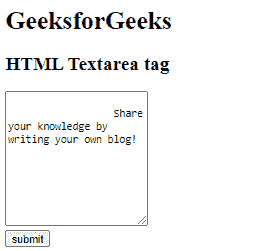
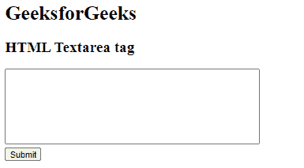

# HTML textarea tag

> 原文：[https://www.geeksforgeeks.org/html-textarea-tag/](https://www.geeksforgeeks.org/html-textarea-tag/)

**Example:** This simple example illustrates the use of the <textarea> tag in HTML that enables the multi-line text input control.

## HTML

```html
<!DOCTYPE html>
<html>
<head>
    <title>textarea tag</title>
</head>

<body>
    <h1>GeeksForGeeks</h1>
    <h2>HTML Textarea tag </h2>
    <form action="#">
        <textarea rows="10"
                  cols="20"
                  name="blog">
          Share your knowledge by writing your own blog!
        </textarea>
        <br>
        <input type="submit"
               value="submit">
    </form>
</body>
</html>
```

**Output: **



The <textarea> tag defines a multi-line plain-text editing control. A text space will hold an infinite range of characters, and therefore the text renders in a set-width font (usually Courier). The size of a text area is often such by the cols and rows attributes, or perhaps better; through CSS’ height and dimension properties. The textarea is generally used in a form, to collect user inputs like comments or reviews. The *name* attribute is needed for the reference in the form data after the form is submitted. By omitting the n*ame* attribute, data from the text area will not be submitted. The *id* attribute is required to link the text area with a label.

**Syntax:**

```html
<textarea>....</textarea>
```

**Attribute values:**

*   [**autocomplete**](https://www.geeksforgeeks.org/html-textarea-autocomplete-attribute/#:~:text=The%20HTML%20autocomplete%20Attribute,which%20the%20user%20entered%20before.)**:** It is used to specify whether the Textarea field has autocompleted on or off.
*   [**autofocus**](https://www.geeksforgeeks.org/html-textarea-autofocus-attribute/)**:** It is used to specify that the textarea field should get automatically focus when the page loads.
*   [**cols**](https://www.geeksforgeeks.org/html-textarea-cols-attribute/)**:** It is used to tell the browser how many average-width characters should fit on a single line i.e the number of columns to display.
*   [**dirname**](https://www.geeksforgeeks.org/html-textarea-dirname-attribute/): It is used to enable the text direction of the Textarea Field after submitting the form.
*   [**disabled**](https://www.geeksforgeeks.org/html-textarea-disabled-attribute/)**:** It is used to specify that the text area element is disabled.
*   [**form**](https://www.geeksforgeeks.org/html-textarea-form-attribute/)**:** It is used to specify the one or more forms that the <Textarea> element belongs to.
*   [**maxlength**](https://www.geeksforgeeks.org/html-textareamaxlength-attribute/)**:** It is used to specify the maximum number of characters enters into the Textarea element.
*   [**minlength**](https://www.geeksforgeeks.org/html-textarea-minlength-attribute/)**:** It is used to define the minimum number of characters (as UTF-16 code units) of a Textarea Element.
*   [**name**](https://www.geeksforgeeks.org/html-textarea-name-attribute/#:~:text=The%20HTML%20name%20Attribute,the%20element%20in%20a%20JavaScript.&text=Attribute%20Values%3A%20It%20contains%20the,for%20the%20element.)**:** It is used to specify the name of the <Textarea> element.
*   [**placeholder**](https://www.geeksforgeeks.org/html-textarea-placeholder-attribute/)**:** It is used to specify the expected value to be displayed before user input in textarea element.
*   [**readonly**](https://www.geeksforgeeks.org/html-textarea-readonly-attribute/#:~:text=The%20readonly%20attribute%20in,It%20is%20a%20boolean%20attribute.)**:** It is used to specify that the textarea element is read-only. If the textarea is readonly, then its content cannot be changed but can be copied and highlighted.
*   [**required**](https://www.geeksforgeeks.org/html-textarea-required-attribute/)**:** It is a boolean attribute that is used to specify that the <textarea> element must be filled out before submitting the Form.
*   [**rows**](https://www.geeksforgeeks.org/html-textarea-rows-attribute/)**:** It is used to specify the number of visible text lines for the control i.e. the number of rows to display.
*   [**wrap**](https://www.geeksforgeeks.org/html-textarea-wrap-attribute/): It is used to specify that in which manner the text is to be wrapped in a text area when a form is submitted.

**Example:** In this example, we have used the *resize* property whose value is set to *none* that will disable the resize option of the textarea.

## HTML

```html
<!DOCTYPE html>
<html>
<head>
     <title>HTML textarea tag</title>
     <style>
        textarea {
            resize: none;
        }
    </style>
</head>

<body>
    <h1>GeeksforGeeks</h1>
    <h2>HTML Textarea tag </h2>
    <form action="#">
        <textarea rows="7"
                  cols="50"
                  name="comment">
        </textarea>
        <br>
        <input type="submit">
    </form>
</body>
</html>
```

**Output:** 



**Supported Browsers:**

*   Google Chrome 93.0
*   Internet Explorer 11.0
*   Microsoft Edge 93.0
*   Firefox 92.0
*   Safari 14.1
*   Opera 78.0