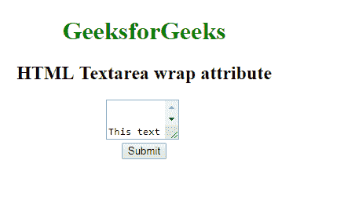

# HTML | textarea wrap Attribute

> 原文：[https://www.geeksforgeeks.org/html-textarea-wrap-attribute/](https://www.geeksforgeeks.org/html-textarea-wrap-attribute/)

The **HTML textarea wrap Attribute** is used to specify that *in which manner the text is to be wrapped in a text area when a form is submitted*.

**Syntax:**

```html
<textarea wrap="soft|hard"> 
```

**Attribute Values:**

*   **soft:** It specifies that the Text present in the Textarea would not be wrapped after submitting the form.
*   **Hard:** It specifies that the Text in a Textarea is wraps when submitting the form.

**Example:** This Example that illustrates the use of wrap attribute in the Textarea Element.

```html
<!DOCTYPE html>
<html>

<head>
    <title>
        HTML Textarea wrap attribute
    </title>
</head>

<body style="text-align:center">
    <h1 style="color: green;"> 
    GeeksforGeeks 
</h1>
    <h2> 
    HTML Textarea wrap attribute 
</h2>

    <!-- Assigning id to textarea. -->
    <textarea id="GFG_ID"
              rows="3"
              cols="10" 
              name="Geeks" 
              wrap="hard">
        This text is wrapped in the text area field.
    </textarea>
    <br>

    <button onclick="myGeeks()">
        Submit
    </button>
</body>

</html>
```

**Output:**


**Supported Browsers:**

*   Google Chrome
*   Firefox
*   Edge
*   Opera
*   Apple Safari