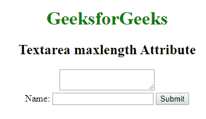

# HTML Textareamaxlength attribute

> 原文：[https://www.geeksforgeeks.org/html-textareamaxlength-attribute/](https://www.geeksforgeeks.org/html-textareamaxlength-attribute/)

The **HTML <Textarea>maxlength attribute** is used to specify the maximum number of characters enters into the Textarea element.

**Syntax:**

```html
<Textarea maxlength ="number">
```

**Attribute Value:**

**number:**

**Example:**

```html
<!DOCTYPE html> 
<html> 

<head> 
    <title>Textarea maxlength Attribute</title> 
    <style> 
    } 
    fieldset { 
        width: 50%; 
        margin-left: 22%; 
    } 
    h1 { 
        color: green; 
    } 
    </style> 
</head> 

<body> 
    <center> 
        <h1>GeeksforGeeks</h1> 
        <h2>Textarea maxlength Attribute</h2> 
        <textarea form="mygeeks"  maxlength="9"> 
        </textarea> 
        <br> 
        <form id="mygeeks"> 
            Name: 
            <input type="text" name="usrname"> 
            <input type="submit"> 
        </form> 
    </center> 
</body> 

</html> 
```

**Output:**


**Supported Browsers:** The browsers supported by HTML <Textarea>maxlength attribute are listed below:

*   Google Chrome
*   Internet Explorer 10.0 +
*   Firefox 4.0
*   Opera 15.0
*   Safari