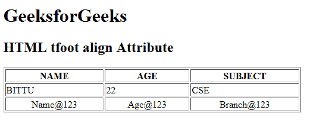

# HTML | tfoot align Attribute

> 原文：[https://www.geeksforgeeks.org/html-tfoot-align-attribute/](https://www.geeksforgeeks.org/html-tfoot-align-attribute/)

The **HTML <tfoot> align Attribute** is used to *set the horizontal alignment of text content inside the table footer (tfoot)*. It is not supported by HTML 5.

**Syntax:**

```html
<tfoot align="left | right | center | justify | char">
```

**Attribute Value:**

*   **left:** It sets the table footer text left-align.
*   **right:** It sets the table footer text right-align.
*   **center:** It sets the table footer text center-align.
*   **justify:** It stretches the table footer text of paragraph to set the width of all lines equal.
*   **char:** It sets the text-align to a specific character.

**Example:**

```html
<!DOCTYPE html>
<html>

<head>
    <title>
        HTML tfoot align Attribute
    </title>
</head>

<body>
    <h1>GeeksforGeeks</h1>

    <h2>HTML tfoot align Attribute</h2>

    <table border="1" width="500">
        <tr>
            <th>NAME</th>
            <th>AGE</th>
            <th>SUBJECT</th>
        </tr>

        <tr>
            <td>BITTU</td>
            <td>22</td>
            <td>CSE</td>
        </tr>

        <tfoot align="center">
            <tr>
                <td>Name@123</td>
                <td>Age@123</td>
                <td>Branch@123</td>
            </tr>
        </tfoot>
    </table>
</body>

</html>
```

**Output:**


**Supported Browsers:** The browser supported by **HTML <tfoot> align attribute** are listed below:

*   Google Chrome
*   Internet Explorer
*   Firefox
*   Safari
*   Opera