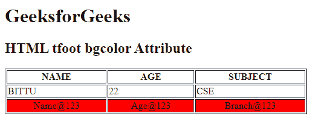

# HTML | tfoot bgcolor Attribute

> 原文：[https://www.geeksforgeeks.org/html-tfoot-bgcolor-attribute/](https://www.geeksforgeeks.org/html-tfoot-bgcolor-attribute/)

The **HTML <tfoot> bgcolor Attribute** is used to specify the background color of a foot of the table. It is not supported by HTML 5.

**Syntax:**

```html
<tfoot bgcolor= "color_name | hex_number | rgb_number">
```

**Attribute Values:**

*   **color_name:** It sets the text color by using the color name. For example *“red”*.
*   **hex_number:** It sets the text color by using the color hex code. For example *“#0000ff”*.
*   **rgb_number:** It sets the text color by using the rgb code. For example: *“RGB(0, 153, 0)”*.

**Example:**

```html
<!DOCTYPE html>
<html>

<head>
    <title>
        HTML tfoot bgcolor Attribute
    </title>
</head>

<body>
    <h1>GeeksforGeeks</h1>

    <h2>HTML tfoot bgcolor Attribute</h2>

    <table border="1"
           width="500">
        <tr>
            <th>NAME</th>
            <th>AGE</th>
            <th>SUBJECT</th>
        </tr>

        <tr>
            <td>BITTU</td>
            <td>22</td>
            <td>CSE</td>
        </tr>

        <tfoot align="center" bgcolor="red">
            <tr>
                <td>Name@123</td>
                <td>Age@123</td>
                <td>Branch@123</td>
            </tr>
        </tfoot>
    </table>
</body>

</html>
```

**Output :**


**Supported Browsers:** The browsers supported by **HTML <tfoot> bgcolor attribute** are listed below:

*   Google Chrome
*   Internet Explorer
*   Firefox
*   Safari
*   Opera