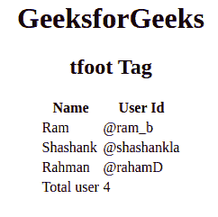

# HTML tfoot Tag

> 哎哎哎:# t0]https://www . geeksforgeeks . org/html-tfoot 标签/

HTML 中的标签用来给页脚组内容。这个标签用在带有标题和正文的 HTML 表格中，称为“标题”和“正文”。标签是表的子标签，和Parent label of.

**语法:**

```html
<tfoot> // Table footer contents... </tfoot>
```

**属性:**<tfoot>标签包含许多 HTML4.1 支持但 HTML5 不支持的属性。

*   [**对齐**](https://www.geeksforgeeks.org/html-tfoot-align-attribute/) **:** 设置文字内容的对齐方式。
*   [](https://www.geeksforgeeks.org/html-tfoot-valign-attribute/)****:用于设置文字内容的垂直对齐方式。****
*   ****字符:**将标题单元格中的内容与字符对齐。**
*   ****charoff:** 用于设置从 char 属性指定的字符开始对齐的字符数。这些属性的值是数字形式的。**

****示例:****

## **超文本标记语言**

```html
<!DOCTYPE html>
<html>

    <body>
        <center>
        <h1>GeeksforGeeks</h1>
        <h2>tfoot Tag</h2>
        <table >
            <thead>
                <tr>
                    <th>Name</th>
                    <th>User Id</th>
                </tr>
            </thead>
            <tbody>
                <tr>
                    <td>Ram</td>
                    <td>@ram_b</td>
                </tr>
                <tr>
                    <td>Shashank</td>
                    <td>@shashankla</td>
                </tr>
                <tr>
                    <td>Rahman</td>
                    <td>@rahamD</td>
                </tr>
            </tbody>

            <!-- tfoot tag starts from here -->
            <tfoot>
                <tr>
                    <td>Total user</td>
                    <td>4</td>
                </tr>
            </tfoot>
            <!-- tfoot tag ends here -->

        </table>
        </center>
    </body>

</html>                   
```

****输出:**** 

****

****支持的浏览器:****

*   **谷歌 Chrome**
*   **微软公司出品的 web 浏览器**
*   **火狐浏览器**
*   **旅行队**
*   **歌剧**