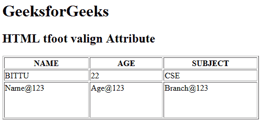

# HTML | tfoot valign Attribute

> 原文：[https://www.geeksforgeeks.org/html-tfoot-valign-attribute/](https://www.geeksforgeeks.org/html-tfoot-valign-attribute/)

The **HTML <tfoot> valign Attribute** is used to *specify the vertical alignment of text content in a table footer cell*. It is not supported by HTML 5.

**Syntax:**

```html
<tfoot valign="top | middle | bottom | baseline">
```

**Attribute Value:**

*   **top:** It sets the content to top-align.
*   **middle:** It sets the content to middle-align.
*   **bottom:** It sets the content to bottom-align.
*   **baseline:** It sets the content to baseline. The baseline is the line where most of the characters sit.

**Example:**

```html
<!DOCTYPE html>
<html>

<head>
    <title>
        HTML tfoot valign Attribute
    </title>
</head>

<body>
    <h1>GeeksforGeeks</h1>

    <h2>HTML tfoot valign Attribute</h2>

    <table border="1" width="500">
        <tr>
            <th>NAME</th>
            <th>AGE</th>
            <th>SUBJECT</th>
        </tr>

        <tr>
            <td>BITTU</td>
            <td>22</td>
            <td>CSE</td>
        </tr>

        <tfoot valign="top">
            <tr style="height:70px">
                <td>Name@123</td>
                <td>Age@123</td>
                <td>Branch@123</td>
            </tr>
        </tfoot>
    </table>
</body>

</html>
```

**Output:**


**Supported Browsers:** The browser supported by **HTML <tfoot> valign attribute** are listed below:

*   Google Chrome
*   Internet Explorer
*   Firefox
*   Safari
*   Opera