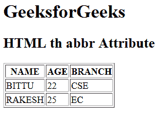

# HTML | th abbr Attribute

> 原文：[https://www.geeksforgeeks.org/html-th-abbr-attribute/](https://www.geeksforgeeks.org/html-th-abbr-attribute/)

The **HTML <th> abbr Attribute** is used to *specify the shorter version of content in header cell*. It does not describe any visual effect but it is used by screen readers.

**Syntax:**

```html
<th abbr="text">
```

**Attribute Values:**

*   **text:** It contains the short description of header cell content.

**Example:**

```html
<!DOCTYPE html>
<html>

<head>
    <title>HTML th abbr Attribute</title>
</head>

<body>
    <h1>GeeksforGeeks</h1>

    <h2>HTML th abbr Attribute</h2>

    <table border="1">
        <tr>
            <th abbr="name of student">NAME</th>
            <th abbr="age of student">AGE</th>
            <th abbr="branch name">BRANCH</th>
        </tr>

        <tr>
            <td>BITTU</td>
            <td>22</td>
            <td>CSE</td>
        </tr>

        <tr>
            <td>RAKESH</td>
            <td>25</td>
            <td>EC</td>
        </tr>
    </table>
</body>

</html>
```

**Output:**


**Supported Browsers:** The browser supported by **HTML <th> abbr attribute** are listed below:

*   Google Chrome
*   Internet Explorer
*   Firefox
*   Safari
*   Opera