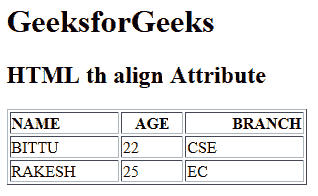

# HTML | th align Attribute

> 原文：[https://www.geeksforgeeks.org/html-th-align-attribute/](https://www.geeksforgeeks.org/html-th-align-attribute/)

The **HTML <th> align Attribute** is used to *set the horizontal alignment* of text content inside the table header cell.

**Syntax:**

```html
<th align= "left | right | center | justify | char">
```

**Attribute Values:**

*   **left:** It sets the text left-align.
*   **right:** It sets the text right-align.
*   **center:** It sets the text center-align.
*   **justify:** It stretches the text of paragraph to set the width of all lines equal.
*   **char:** It sets the text-align to a specific character.

**Example:**

```html
<!DOCTYPE html>
<html>

<head>
    <title>
      HTML th align Attribute
  </title>
</head>

<body>
    <h1>GeeksforGeeks</h1>

    <h2>HTML th align Attribute</h2>

    <table width="300" border="1">
        <tr>
            <th align="left">NAME</th>
            <th align="center">AGE</th>
            <th align="right">BRANCH</th>
        </tr>

        <tr>
            <td>BITTU</td>
            <td>22</td>
            <td>CSE</td>
        </tr>

        <tr>
            <td>RAKESH</td>
            <td>25</td>
            <td>EC</td>
        </tr>
    </table>
</body>

</html>
```

**Output:**


**Supported Browsers:** The browser supported by **HTML <th> align attribute** are listed below:

*   Google Chrome
*   Internet Explorer
*   Firefox
*   Safari
*   Opera