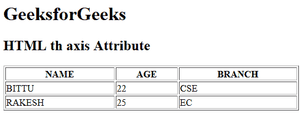

# HTML | th axis Attribute

> 原文：[https://www.geeksforgeeks.org/html-th-axis-attribute/](https://www.geeksforgeeks.org/html-th-axis-attribute/)

The **HTML <th> axis attribute** is used to *categorize the header cell content*. It is used for group related information. This attribute does not display visual effect on the web browser but it is used by screen readers. It is not supported by HTML 5.

**Syntax:**

```html
<th axis="category_name">
```

**Attribute Values:**

*   **category_name:** It is used to specify the category name.

**Example:**

```html
<!DOCTYPE html>
<html>

<head>
    <title>HTML th axis Attribute</title>
</head>

<body>
    <h1>GeeksforGeeks</h1>

    <h2>HTML th axis Attribute</h2>

    <table width="500" border="1">
        <tr>
            <th axis="student_name">NAME</th>
            <th axis="student_age">AGE</th>
            <th axis="student_branch">BRANCH</th>
        </tr>

        <tr>
            <td>BITTU</td>
            <td>22</td>
            <td>CSE</td>
        </tr>

        <tr>
            <td>RAKESH</td>
            <td>25</td>
            <td>EC</td>
        </tr>
    </table>
</body>

</html>
```

**Output:**


**Supported Browsers:** The browser supported by **HTML <th> axis attribute** are listed below:

*   Google Chrome
*   Internet Explorer
*   Firefox
*   Safari
*   Opera