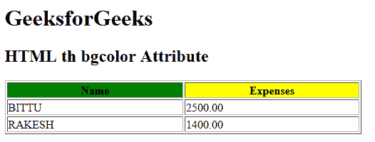

# HTML | th bgcolor Attribute

> 原文：[https://www.geeksforgeeks.org/html-th-bgcolor-attribute/](https://www.geeksforgeeks.org/html-th-bgcolor-attribute/)

The **HTML <th> bgcolor Attribute** is used to *specify the background color of a table header cell*. It is not supported by HTML 5.

**Syntax:**

```html
<th bgcolor="color_name | hex_number | rgb_number">
```

**Attribute Values:**

*   **color_name:** It sets the background color by using the color name. For example *“red”*.
*   **hex_number:** It sets the background color by using the color hex code. For example *“#0000ff”*.
*   **rgb_number:** It sets the background color by using the rgb code. For example: *“RGB(0, 153, 0)”* .

**Example:**

```html
<!DOCTYPE html>
<html>

<head>
    <title>
      HTML th bgcolor Attribute
  </title>
</head>

<body>
    <h1>GeeksforGeeks</h1>

    <h2>HTML th bgcolor Attribute</h2>

    <table width="500" border="1">
        <tr>
            <th bgcolor="green">Name</th>
            <th bgcolor="yellow">Expenses</th>
        </tr>

        <tr>
            <td>BITTU</td>
            <td>2500.00</td>
        </tr>

        <tr>
            <td>RAKESH</td>
            <td>1400.00</td>
        </tr>
    </table>
</body>

</html>
```

**Output:**


**Supported Browsers:** The browser supported by **HTML <th> bgcolor attribute** are listed below:

*   Google Chrome
*   Internet Explorer
*   Firefox
*   Safari
*   Opera