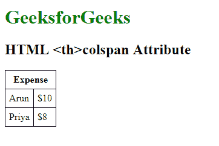

# HTML | th colspan Attribute

> 原文：[https://www.geeksforgeeks.org/html-th-colspan-attribute/](https://www.geeksforgeeks.org/html-th-colspan-attribute/)

The **<th> colspan Attribute** in HTML is used to specify a number of columns a header cell should span.

**Syntax:**

```html
<th colspan="number"> 
```

**Attribute Values:** It contains single value **number** which contains the numeric value to sets the number of column a header cell should span.

**Example:** This example illustrates the use of colspan attribute in <th> tag.

```html
<!DOCTYPE html> 
<html> 
    <head> 
        <title>HTML colspan Attribute</title> 
        <style> 
            table, th, td { 
                border: 1px solid black; 
                border-collapse: collapse; 
                padding: 6px; 
            } 
        </style> 
    </head> 

    <body> 

        <h1 style = "color: green;">GeeksforGeeks</h1> 
        <h2>HTML <th>colspan Attribute</h2> 

        <table> 
            <tr> 
                <th colspan="2">Expense</th> 
            </tr> 

            <tr> 
                <td>Arun</td> 
                <td>$10</td> 
            </tr> 

            <tr> 
                <td>Priya</td> 
                <td>$8</td> 
            </tr> 
        </table> 
    </body> 
</html>                     
```

**Output:**


**Supported Browsers:** The browser supported by **HTML <th>colspan attribute** are listed below:

*   Google Chrome
*   Internet Explorer
*   Firefox
*   Opera
*   Safari