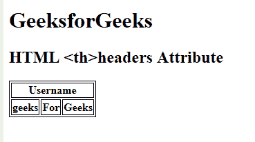

# HTML | th headers Attribute

> 原文：[https://www.geeksforgeeks.org/html-th-headers-attribute/](https://www.geeksforgeeks.org/html-th-headers-attribute/)

The **HTML <th> headers Attribute** is used to *specify the table cell containing Header information for the current header cell*.

**Syntax:**

```html
<th headers="header_id">
```

**Attribute Values:** It contains the value i.e **header_id** which specify the space to the separated list of id’s to one or more Header cell that the table header cell is related to.

**Example:**

```html
<!DOCTYPE html>
<html>

<head>

    <!-- style to set border -->
    <style>
        table,
        th,
        td {
            border: 1px solid black;
        }
    </style>
</head>

<body>

    <h1>GeeksforGeeks</h1>

    <h2>HTML <th>headers Attribute</h2>

    <table>
        <tr>
            <th id="table"
                colspan="3">Username</th>
        </tr>

        <tr>
            <th Headers="Username">geeks</th>
            <th Headers="Username">For</th>
            <th Headers="Username">Geeks</th>
        </tr>
    </table>
</body>

</html>
```

**Output:**


**Supported Browsers:** The browsers supported by **<th> headers Attribute** are listed below:

*   Google Chrome
*   Internet Explorer
*   Firefox
*   Apple Safari
*   Opera