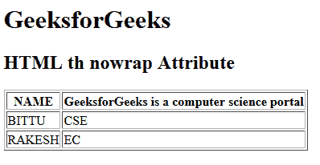

# HTML | th nowrap Attribute

> 原文：[https://www.geeksforgeeks.org/html-th-nowrap-attribute/](https://www.geeksforgeeks.org/html-th-nowrap-attribute/)

The **HTML <th> nowrap Attribute** is used to *specify that the content present inside the header cell should not wrap*. It contains the Boolean value. It is not supported by HTML 5.

**Syntax:**

```html
<th nowrap>
```

**Example:**

```html
<!DOCTYPE html>
<html>

<head>
    <title>
        HTML th nowrap Attribute
    </title>
</head>

<body>
    <h1>GeeksforGeeks</h1>

    <h2>HTML th nowrap Attribute</h2>

    <table border="1">
        <tr>
            <th>NAME</th>
            <th nowrap>
              GeeksforGeeks is a computer science portal
          </th>
        </tr>

        <tr>
            <td>BITTU</td>
            <td>CSE</td>
        </tr>

        <tr>
            <td>RAKESH</td>
            <td>EC</td>
        </tr>
    </table>
</body>

</html>
```

**Output:**


**Supported Browsers:** The browser supported by **HTML <th> nowrap attribute** are listed below:

*   Google Chrome
*   Internet Explorer
*   Firefox
*   Safari
*   Opera