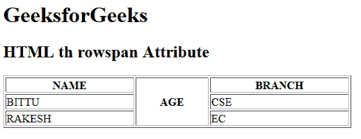

# HTML | rowspan 属性

> 原文:[https://www.geeksforgeeks.org/html-th-rowspan-attribute/](https://www.geeksforgeeks.org/html-th-rowspan-attribute/)

**HTML <第>行跨度属性**用于指定标题行单元格将跨度多少。
**语法:**

```html
<th rowspan="number">
```

**属性值:**

*   **数字:**它包含指定标题单元格应跨越的行数的数值。

**示例:**

## 超文本标记语言

```html
<!DOCTYPE html>
<html>

<head>
    <title>
        HTML th rowspan Attribute
    </title>
</head>

<body>
    <h1>GeeksforGeeks</h1>

    <h2>HTML th rowspan Attribute</h2>

    <table border="1" width="500">
        <tr>
            <th>NAME</th>
            <th rowspan="3">AGE</th>
            <th>BRANCH</th>
        </tr>

        <tr>
            <td>BITTU</td>
            <td>CSE</td>
        </tr>

        <tr>
            <td>RAKESH</td>
            <td>EC</td>
        </tr>
    </table>
</body>

</html>
```

**输出:**



**支持的浏览器:**第>行跨属性的 **HTML <支持的浏览器如下:**

*   谷歌 Chrome
*   微软公司出品的 web 浏览器
*   火狐浏览器
*   旅行队
*   歌剧