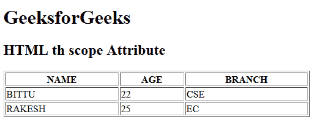

# HTML | th scope Attribute

> 原文：[https://www.geeksforgeeks.org/html-th-scope-attribute/](https://www.geeksforgeeks.org/html-th-scope-attribute/)

The **HTML <th> scope Attribute** is used to *specify the header cell is used for header row, column, colgroup or rowgroup*. This attribute does not display any visual effect on the browser but it is used for screen readers.

**Syntax:**

```html
<th scope="col | row | colgroup | rowgroup">
```

**Attribute Values:**

*   **col:** It specifies that the header cell is used for column.
*   **row:** It specifies that the header cell is used for row.
*   **colgroup:** It specifies that the header cell is used for group of column.
*   **rowgroup:** It specifies that the header cell is used for group of row.

**Example:**

```html
<!DOCTYPE html>
<html>

<head>
    <title>
        HTML th scope Attribute
    </title>
</head>

<body>
    <h1>GeeksforGeeks</h1>

    <h2>HTML th scope Attribute</h2>

    <table border="1" width="500">
        <tr>
            <th scope="col">NAME</th>
            <th scope="col">AGE</th>
            <th scope="col">BRANCH</th>
        </tr>

        <tr>
            <td>BITTU</td>
            <td>22</td>
            <td>CSE</td>
        </tr>

        <tr>
            <td>RAKESH</td>
            <td>25</td>
            <td>EC</td>
        </tr>
    </table>
</body>

</html>
```

**Output:**


**Supported Browsers:** The browser supported by **HTML <th> scope attribute** are listed below:

*   Google Chrome
*   Internet Explorer
*   Firefox
*   Safari
*   Opera