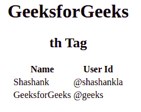

# HTML 第十个标签

> 原文:[https://www.geeksforgeeks.org/html-th-tag/](https://www.geeksforgeeks.org/html-th-tag/)

HTML 中的Tag is used to set the title cell of the table. There are two types of cells in HTML tables.

*   **表头单元格:**用于保存表头信息。
*   **标准单元格:**用于保存数据体。

两个标签(and) works in the same way, but the text properties are different. existIn, the text is centered in bold, and in, the text is regular and left-aligned by default.
**Syntax:**

```html
<th> Contents... </th>
```

**属性:**html 4.1 支持很多属性，但从 HTML5 中删除的属性如下:

*   [**缩写**](https://www.geeksforgeeks.org/html-th-abbr-attribute/) **:** 该属性用作标题单元格中文本内容的缩写。
*   [**对齐**](https://www.geeksforgeeks.org/html-th-align-attribute/) **:** 设置文字内容的对齐方式。
*   [**轴**](https://www.geeksforgeeks.org/html-th-axis-attribute/) **:** 类别表头单元格。
*   [**【bgcolor】**](https://www.geeksforgeeks.org/html-th-bgcolor-attribute/)**:设置表头单元格的背景色。**
*   **字符:**将标题单元格中的内容与字符对齐。
*   **charoff:** 用于设置从 char 属性指定的字符开始对齐的字符数。这些属性的值是数字形式的。
*   [**列跨度**](https://www.geeksforgeeks.org/html-th-colspan-attribute/) **:** 标题单元格应跨度的列数。
*   [**标题**](https://www.geeksforgeeks.org/html-th-headers-attribute/) **:** 指定一个单元格相关的一个或多个标题单元格。
*   [**高度**](https://www.geeksforgeeks.org/html-th-height-attribute/) **:设置表头单元格的高度。**
*   [**nowrap**](https://www.geeksforgeeks.org/html-th-nowrap-attribute/) **:** 它指定标题单元格内的内容不应换行。
*   [**行跨度**](https://www.geeksforgeeks.org/html-th-rowspan-attribute/) **:** 设置标题单元格应跨度的行数。
*   [**范围**](https://www.geeksforgeeks.org/html-th-scope-attribute/) **:用于指定表头内容的分值。**
*   **排序:**用于对一列的方向进行排序。
*   [](https://www.geeksforgeeks.org/html-th-valign-attribute/)****:用于设置文字内容的垂直对齐方式。****
*   **[**宽度**](https://www.geeksforgeeks.org/html-th-width-attribute/) **:** 用于设置表头单元格的宽度**

****示例:****

## **超文本标记语言**

```html
<!DOCTYPE html>
<html>
    <body>
        <center>
        <h1>GeeksforGeeks</h1>
        <h2>th Tag</h2>
        <table>
            <thead>
                <tr>
                    <!-- th tag starts here -->
                    <th>Name</th>
                    <th>User Id</th>
                    <!-- th tag end here -->
                </tr>
            </thead>
            <tbody>
                <tr>
                    <td>Shashank</td>
                    <td>@shashankla</td>
                </tr>
                    <tr>
                    <td>GeeksforGeeks</td>
                    <td>@geeks</td>
                </tr>
            </tbody>
        </table>
        </center>
    </body>
</html>
```

****输出:**** 

****

****支持的浏览器:****

*   **谷歌 Chrome**
*   **边缘**
*   **火狐浏览器**
*   **旅行队**
*   **歌剧**