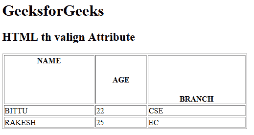

# HTML | th valign Attribute

> 原文：[https://www.geeksforgeeks.org/html-th-valign-attribute/](https://www.geeksforgeeks.org/html-th-valign-attribute/)

The **HTML <th> valign Attribute** is used to *specify the vertical alignment of text content in a header cell*. It is not supported by HTML 5.

**Syntax:**

```html
<th valign="top | middle | bottom | baseline">
```

**Attribute Value:**

*   **top:** It sets the table header content to top-align.
*   **middle:** It sets the table header content to middle-align.
*   **bottom:** It sets the table header content to bottom-align.
*   **baseline:** It sets the table header content to baseline. The baseline is the line where most of the characters sit.

**Example:**

```html
<!DOCTYPE html>
<html>

<head>
    <title>
        HTML th valign Attribute
    </title>
</head>

<body>
    <h1>GeeksforGeeks</h1>

    <h2>HTML th valign Attribute</h2>

    <table border="1" width="500">
        <tr style="height:100px;">
            <th valign="top">NAME</th>
            <th valign="center">AGE</th>
            <th valign="bottom">BRANCH</th>
        </tr>

        <tr>
            <td>BITTU</td>
            <td>22</td>
            <td>CSE</td>
        </tr>

        <tr>
            <td>RAKESH</td>
            <td>25</td>
            <td>EC</td>
        </tr>
    </table>
</body>

</html>
```

**Output:**


**Supported Browsers:** The browser supported by **HTML <th> valign attribute** are listed below:

*   Google Chrome
*   Internet Explorer
*   Firefox
*   Safari
*   Opera