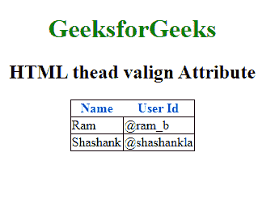

# HTML | thead align Attribute

> 原文：[https://www.geeksforgeeks.org/html-thead-align-attribute/](https://www.geeksforgeeks.org/html-thead-align-attribute/)

The **HTML <thead> align attribute** is used to set the horizontal alignment of text content inside the table head (thead) section.

**Syntax:**

```html
<thead align="left|right|center|justify|char">
```

**Attribute Value:**

*   **left:** It sets the text left-align.
*   **right:** It sets the text right-align.
*   **center:** It sets the text center-align.
*   **justify:** It stretches the text to set the width of all lines equal in table head.
*   **char:** It sets the text-align to a specific character.

**Example:**

```html
<!DOCTYPE html> 
<html> 

<head> 
    <title>
        HTML thead align Attribute 
    </title> 

    <style> 
        h1 { 
            color: green; 
        } 
        thead { 
            color: blue; 
        } 
        table, tbody, td { 
            border: 1px solid black; 
            border-collapse: collapse; 
        } 
    </style> 
</head> 

<body> 
    <center> 
        <h1>GeeksforGeeks</h1> 
        <h2>HTML thead align Attribute</h2> 

        <table> 
            <!-- thead tag starts from here -->
            <thead align="char" valign="bottom"
                        char="M"> 
                <tr> 
                    <th>Name</th> 
                    <th>User Id</th> 
                </tr> 
            </thead> 
            <!-- thead tag ends here -->

            <tbody> 
                <tr> 
                    <td>Ram</td> 
                    <td>@ram_b</td> 
                </tr> 
                <tr> 
                    <td>Shashank</td> 
                    <td>@shashankla</td> 
                </tr> 
            </tbody> 
        </table> 
    </center> 
</body> 

</html>
```

**Output**


**Supported Browsers:** The browser supported by HTML <thead> align attribute are listed below:

*   Google Chrome
*   Internet Explorer
*   Firefox
*   Safari
*   Opera