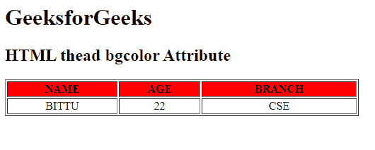

# HTML |背景颜色属性

> 原文:[https://www.geeksforgeeks.org/html-thead-bgcolor-attribute/](https://www.geeksforgeeks.org/html-thead-bgcolor-attribute/)

**HTML 和 bgcolor 属性**用于指定表格标题的背景颜色。HTML 5 不支持。

**语法:**

```html
<thead bgcolor= "color_name | hex_number | rgb_number">
```

**属性值:**

*   **color_name:** 使用颜色名称设置文本颜色。例如*【红色】*。
*   **十六进制数:**使用颜色十六进制码设置文本颜色。例如*“# 0000 ff”*。
*   **rgb_number:** 使用 rgb 代码设置文本颜色。例如:*“RGB(0，153，0)”*。

**示例:**

```html
<!DOCTYPE html> 
<html> 

<head> 
    <title> 
        HTML thead bgcolor Attribute 
    </title> 
</head> 

<body> 
    <h1>GeeksforGeeks</h1> 

    <h2>HTML thead bgcolor Attribute</h2> 

    <table border="1"
        width="500"> 
        <thead bgcolor="red"> 
            <tr> 
                <th>NAME</th> 
                <th>AGE</th> 
                <th>BRANCH</th> 
            </tr> 
        </thead> 

        <tbody align="center" > 
            <tr> 
                <td>BITTU</td> 
                <td>22</td> 
                <td>CSE</td> 
            </tr> 
        </tbody> 
    </table> 
</body> 

</html> 
```

**输出:**


**支持的浏览器:**T2 HTML<和> bgcolor 属性支持的浏览器如下:

*   谷歌 Chrome
*   微软公司出品的 web 浏览器
*   火狐浏览器
*   旅行队
*   歌剧