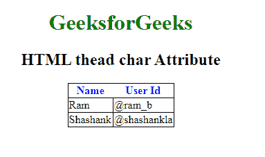

# HTML | 字符属性

> 原文:[https://www.geeksforgeeks.org/html-thead-char-attribute/](https://www.geeksforgeeks.org/html-thead-char-attribute/)

**HTML 字符属性**用于指定与元素中内容的字符对齐。仅当 align 属性设置为“char”时，才能使用该属性。它的默认值是页面语言的小数点。HTML 5 不支持。

**语法:**

```html
<thead char="character">
```

**属性值:**

*   **Character:** The character used to specify the content to be aligned.

**示例:**

```html
<!DOCTYPE html> 
<html> 
    <head> 
        <title>thead char Attribute</title> 
        <style> 
            h1 { 
                color:green; 
            } 
            thead { 
                color:blue; 
            } 
            table, tbody, td { 
                border: 1px solid black; 
                border-collapse: collapse; 
            } 
        </style> 
    </head> 
    <body> 
        <center> 
        <h1>GeeksforGeeks</h1> 
        <h2> HTML thead char Attribute</h2> 
        <table> 

            <!-- thead tag starts from here -->
            <thead align="char" char="M"> 
                <tr> 
                <th>Name</th> 
                <th>User Id</th> 
                </tr> 
            </thead> 
            <!-- thead tag ends here -->

            <tbody> 
                <tr> 
                <td>Ram</td> 
                <td>@ram_b</td> 
                </tr> 
                <tr> 
                <td>Shashank</td> 
                <td>@shashankla</td> 
                </tr> 
            </tbody> 
        </table> 
        </center> 
    </body> 
</html>                     
```

**输出:**


**支持的浏览器:****<和> char Attribute** 不受任何主要浏览器的支持。