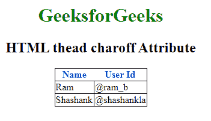

# HTML | thead charoff Attribute

> 原文：[https://www.geeksforgeeks.org/html-thead-charoff-attribute/](https://www.geeksforgeeks.org/html-thead-charoff-attribute/)

The **HTML <thead> charoff Attribute** is used to sets the number of characters that aligned the characters specified by the char Attribute. This attribute can only be used in the char attribute and align attribute is specified in the [thead](https://www.geeksforgeeks.org/html-thead-tag/) Element.

**Syntax:**

```html
<thead charoff="number">
```

**Attribute Values:**

*   **number:** It contains the numeric value which specify the alignment.
    1.  **Positive values:** indicate the alignment to the right of the characters.
    2.  **Negative values:** indicate the alignment to the left of the characters.

**Example:**

```html
<!DOCTYPE html>
<html>

<head>
    <title>HTML <thead> charoff Attribute

    </title>
    <style>
        h1 {
            color: green;
        }

        thead {
            color: blue;
        }

        table,
        tbody,
        td {
            border: 1px solid black;
            border-collapse: collapse;
        }
    </style>
</head> baseline: It sets the content to baseline.

<body>
    <center>
        <h1>GeeksforGeeks</h1>
        <h2> HTML thead charoff Attribute

       </h2>
        <table>

            <!-- thead tag starts from here -->
            <thead align="char"
                   valign="bottom"
                   char="M" 
                   charoff="2">
                <tr>
                    <th>Name</th>
                    <th>User Id</th>
                </tr>
            </thead>
            <!-- thead tag ends here -->

            <tbody>
                <tr>
                    <td>Ram</td>
                    <td>@ram_b</td>
                </tr>
                <tr>
                    <td>Shashank</td>
                    <td>@shashankla</td>
                </tr>
            </tbody>
        </table>
    </center>
</body>

</html>
```

**Output :**


**Supported Browsers:** The browsers supported by **HTML <thead> charoff Attribute** are listed below:

*   Google Chrome *Not supported*
*   Internet Explorer *Not supported*
*   Firefox *Not supported*
*   Apple Safari *Not supported*
*   Opera *Not supported*