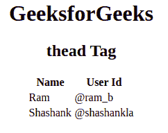

# HTML 标签

> 原文:[https://www.geeksforgeeks.org/html-thead-tag/](https://www.geeksforgeeks.org/html-thead-tag/)

HTML 中的标签用来给正文的一组内容赋予一个标题。该标签在 HTML 表格中用作头部和身体，称为**头部**和**身体**。

**语法:**

```html
<thead>
// Table head Contents...
</thead>
```

**属性:**

*   [**对齐**](https://www.geeksforgeeks.org/html-thead-align-attribute/) **:** 设置文字内容的对齐方式。
*   [](https://www.geeksforgeeks.org/html-thead-valign-attribute/)****:设置文字内容的垂直对齐方式。****
*   **[**char**](https://www.geeksforgeeks.org/html-thead-char-attribute/) **:** 将<和>元素内的内容对齐设置为一个字符。**
*   **[](https://www.geeksforgeeks.org/html-thead-charoff-attribute/)****:**用于设置从字符属性指定的字符开始对齐的字符数。这些属性的值是数字形式的。****

******示例:******

## ****超文本标记语言****

```html
**<!DOCTYPE html>
<html>
    <body>
        <center>
        <h1>GeeksforGeeks</h1>
        <h2>thead Tag</h2>
        <table>

            <!-- thead tag starts from here -->
            <thead>
                <tr>
                <th>Name</th>
                <th>User Id</th>
                </tr>
            </thead>
            <!-- thead tag ends here -->

            <tbody>
                <tr>
                <td>Ram</td>
                <td>@ram_b</td>
                </tr>
                <tr>
                <td>Shashank</td>
                <td>@shashankla</td>
                </tr>
            </tbody>
        </table>
        </center>
    </body>
</html>**
```

******输出:****** 

********

******支持的浏览器:******

*   ****谷歌 Chrome****
*   ****边缘****
*   ****火狐浏览器****
*   ****旅行队****
*   ****歌剧****