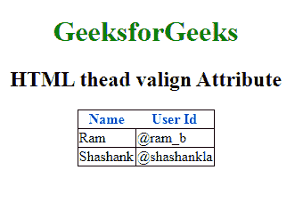

# HTML | thead valign Attribute

> 原文：[https://www.geeksforgeeks.org/html-thead-valign-attribute/](https://www.geeksforgeeks.org/html-thead-valign-attribute/)

The **HTML thead valign Attribute** is used to specify the vertical alignment of content inside the thead Element.

**Syntax:**

```html
<thead valign="top | middle | bottom | baseline">
```

**Attribute values:**

*   **top:** It sets the content to top-align.
*   **middle:** It sets the content to middle-align.
*   **bottom:** It sets the content to bottom-align.
*   **baseline:** It sets the content to baseline. The baseline is the line where most of the characters sit.

**Example:**

```html
<!DOCTYPE html>
<html>

<head>
    <title>HTML <thead> valign Attribute

    </title>
    <style>
        h1 {
            color: green;
        }

        thead {
            color: blue;
        }

        table,
        tbody,
        td {
            border: 1px solid black;
            border-collapse: collapse;
        }
    </style>
</head>

<body>
    <center>
        <h1>GeeksforGeeks</h1>
        <h2> HTML thead valign Attribute</h2>

        <table>
            <!-- thead tag starts from here -->
            <thead align="char" 
                   valign="bottom" 
                   char="M">
                <tr>
                    <th>Name</th>
                    <th>User Id</th>
                </tr>
            </thead>
            <!-- thead tag ends here -->

            <tbody>
                <tr>
                    <td>Ram</td>
                    <td>@ram_b</td>
                </tr>
                <tr>
                    <td>Shashank</td>
                    <td>@shashankla</td>
                </tr>
            </tbody>
        </table>

    </center>
</body>

</html>
```

**Output:**


**Supported Browsers:** The browsers supported by **HTML <thead> valign Attribute** are listed below:

*   Google Chrome
*   Internet Explorer
*   Firefox
*   Apple Safari
*   Opera